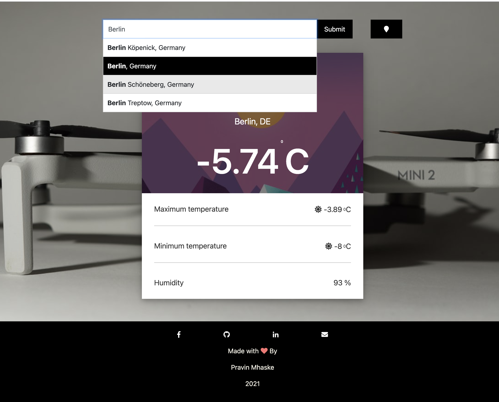

# Weather App

I decided to implement the weather application with javascript and jQuery. The app helps user to fetch the weather condition of specifiec city by selecting it from many options. We can also get weather of user's current city. A nice backend was setup with [openweathermap](http://openweathermap.org/) for fetching the details. App displays current temperature,weather conditions, max min temp and humidity for the day along with time of the request made.

## Prerequisites and Technology Stack

* An [openweathermap](http://openweathermap.org/) API key.
* Javascript (ES5/ES6)
* Bootstrap
* SASS
* Node

**Screenshot**

<p align="center"></p>
<p align="center"></p>
<p align="center"></p>
<p align="center"></p>


## Setup

* clone this repository.
* install node modules
* run script converting scss in css
```
npm run scss
```
* start server on port 3000 with script
```
npm run start scss
```
## About code structure
<p align="center"></p>

### Folders explained
#### public
* constants - holds application constants i.e. api key , app url 
* css - Folder gets generated with css file as part of running 'npm run scss' command
* js - it has applications main file main.js, jquery locally downloaded, autocomplete.js
* scss - it consists sass need fo look and feel of web page which compiles to css
* utis - utilities for apllication

#### src
* This folder has server.js file which runs a node server at port 3000 and serves index.html file.


To start the app, run start command and browse in browser at [weatherApp](http://localhost:3000)localhost:3000

```
npm start
```

## References

[Node.js quick file server (static files over HTTP)](https://stackoverflow.com/questions/16333790/node-js-quick-file-server-static-files-over-http)

